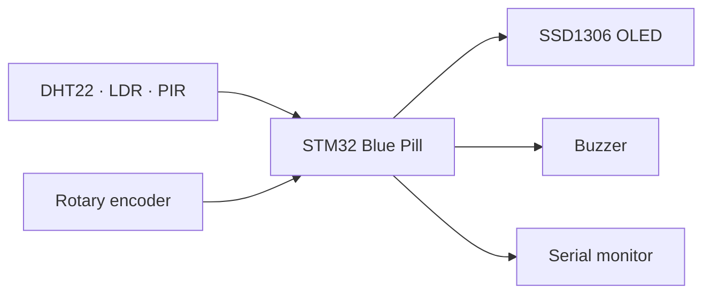
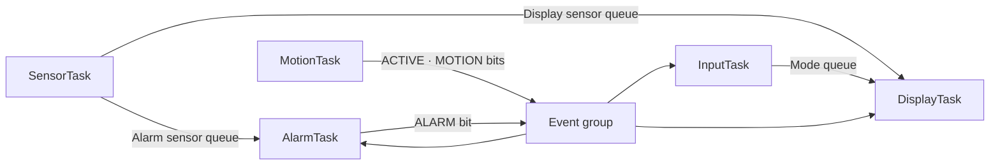
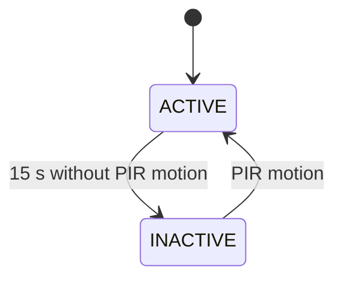

# FreeRTOS STM32 Room Multi-sensor

An STM32 Blue Pill room monitor simulated in Wokwi. Five FreeRTOS tasks read temperature, humidity, ambient light, and motion; navigate an SSD1306 display; and sound a temperature alarm. The firmware uses STM32Cube HAL and native FreeRTOS APIs through PlatformIO.

## Project Overview

The device samples a DHT22 and an ADC connected to a photoresistor every two seconds. A PIR sensor controls an ACTIVE/INACTIVE state after 15 seconds without motion. The OLED displays one selected measurement at a time. A rotary encoder changes pages, and a buzzer sounds outside the 18–30 °C normal temperature range.

## Features

- Temperature and relative humidity from DHT22.
- Relative ADC light level, expressed as a percentage of full scale.
- Motion indication and automatic display sleep/reactivation.
- Four OLED pages: Temperature, Humidity, Light, Motion.
- Low and high temperature alarms with a buzzer.
- Serial diagnostics protected by a mutex.

## Learning Objectives

This project demonstrates periodic FreeRTOS tasks, task priorities, queues, event groups, mutexes, a small state machine, hardware-independent unit tests, and static analysis in an STM32Cube project.

## System Architecture



*Figure 1. Sensors and user input feed the STM32, which controls the display, alarm, and diagnostics.*


*Figure 2. Wokwi circuit and pin connections. *

## FreeRTOS Architecture



*Figure 3. Separate queues deliver the newest sensor sample to DisplayTask and AlarmTask. Event bits represent activity, motion, and alarm state. The serial mutex protects diagnostic output from all tasks.*

## Hardware / Simulated Components

| Component | Role |
|---|---|
| STM32 Blue Pill (STM32F103C8) | Controller |
| DHT22 | Temperature and humidity |
| Photoresistor module | Analog light input |
| PIR sensor | Motion input |
| KY-040 rotary encoder | Page navigation |
| SSD1306 OLED | Selected measurement and alarm indicator |
| Buzzer | Audible temperature alarm |

## Pin Configuration

| STM32 pin | Connection | Interface |
|---|---|---|
| PB0 | DHT22 SDA with 10 kΩ pull-up | Digital, timing based |
| PA0 | Photoresistor AO | ADC1 channel 0 |
| PB1 | PIR OUT | Digital input |
| PB12 / PB13 | Encoder CLK / DT | EXTI / digital input |
| PB6 / PB7 | OLED SCL / SDA | I2C1 |
| PA2 | Buzzer | TIM2 channel 3 PWM |
| PA9 / PA10 | Serial monitor RX / TX | USART1 TX / RX |

Power and ground wiring are defined in `diagram.json`.

## Task Design

| Task | Priority | Work and blocking behavior |
|---|---:|---|
| MotionTask | 3 | Polls PIR every 100 ms; delays until next poll. |
| InputTask | 3 | Processes encoder changes; delays 50 ms or waits for ACTIVE. |
| SensorTask | 2 | Samples approximately every 2 s using `vTaskDelayUntil()`. |
| AlarmTask | 2 | Waits for sensor data or ACTIVE; owns the buzzer. |
| DisplayTask | 1 | Owns OLED updates; delays 50 ms or waits for ACTIVE. |

Motion and encoder input have the shortest response deadlines. Sensor and alarm work can tolerate the sampling interval; OLED drawing can run after those tasks. `vTaskDelayUntil()` keeps sample starts aligned to a periodic schedule instead of accumulating execution-time drift from each iteration.

The project uses a custom thread-mode FreeRTOS scheduler port for its Wokwi build. TIM3 advances a 20 Hz tick, and context switches occur through task blocking/yield paths; this differs from the standard preemptive Cortex-M FreeRTOS port. A runnable task that does not block can therefore delay a newly ready task. Avoid uncontrolled loops and reevaluate the port before physical deployment.

## Inter-Task Communication

`SensorData` contains temperature, humidity, ADC light percentage, and motion status. SensorTask overwrites separate length-one queues for DisplayTask and AlarmTask, providing each its own latest sample. InputTask overwrites a display-mode queue. MotionTask sets/clears `EVENT_MOTION` and `EVENT_ACTIVE`; AlarmTask maintains `EVENT_ALARM`. DisplayTask reads those bits to show current status. Multiple tasks write to USART1 through `Serial_Print()`, which uses `serialMutex` to prevent diagnostic lines from interleaving.

Failed DHT22 or ADC acquisition does not publish a fabricated zero-valued sample. The OLED marks measurements stale after five seconds without a new sample.

## State Machine



*Figure 4. Fifteen seconds without motion enters INACTIVE. PIR motion restores ACTIVE; MotionTask continues monitoring in both states.*

## Repository Structure

| Path | Contents |
|---|---|
| `src/`, `include/` | Application modules and interfaces |
| `src/cubemx/`, `system/` | STM32 support code |
| `lib/FreeRTOS/` | FreeRTOS kernel and project-specific port |
| `test/` | PlatformIO native unit-test suites |
| `docs/` | Verification record, report, and images |
| `diagram.json`, `wokwi.toml` | Simulated circuit and firmware path |
| `platformio.ini` | Build, check, and test environments |

## Getting Started

Install VS Code, the PlatformIO extension, and Wokwi for VS Code. Open the repository folder containing `platformio.ini`. Native unit tests on Windows additionally need GCC and G++ on `PATH`, such as the MSYS2 UCRT64 toolchain. The STM32 build uses PlatformIO's embedded toolchain.

## Building the Project

```sh
pio run -e bluepill_f103c8
```

The Wokwi firmware path is `.pio/build/bluepill_f103c8/firmware.bin`. Rebuild after source changes before restarting the simulation.

## Running the Wokwi Simulation

Open the project in VS Code, build it, then use **Wokwi: Start Simulator** from the Command Palette. The DHT22 values can be changed by clicking the sensor; use the encoder arrows for page changes and **Simulate Motion** on the PIR. Refer to `docs/functional-verification.md` for the ten test stimuli and observed results.


*Figure 5. Finished system in Wokwi. *

## Unit Testing

```sh
pio test -e native
```

The reported run passed 13 cases: five alarm-boundary tests, four navigation tests, and four state/timeout tests. These tests exercise deterministic decisions on a host computer; they do not validate peripheral wiring or timing in Wokwi.

## Static Code Analysis

```sh
pio check -e bluepill_f103c8
```

The most recently shared run passed with 0 high, 0 medium, and 42 low style findings after two small cleanups. Several `unusedFunction` reports concern HAL hooks, interrupt handlers, and task entry points that are invoked through the embedded build. HAL callback signatures are retained; the FreeRTOS macro cast and explicit OLED command loop are also retained. Record any later results and their interpretation in the laboratory report.

## Functional Verification

FT-01 through FT-10 were reported passing in Wokwi: temperature, humidity, light, both navigation directions, alarm activation and clearance, and ACTIVE/INACTIVE transitions. The inputs and observed outputs belong in `docs/functional-verification.md`. Native unit tests do not establish simulated peripheral behavior.

## Engineering Decisions

- Separate queues allow both OLED and alarm tasks to see the latest sample.
- OLED access belongs to DisplayTask; buzzer access belongs to AlarmTask.
- An encoder ISR captures edges without calling FreeRTOS APIs; InputTask processes navigation.
- A dedicated TIM4 counter times DHT22 pulses. A serial mutex keeps task diagnostics readable.
- Sensor readings are published only when both DHT22 and ADC conversions succeed, because `SensorData` has no validity flags.

## Limitations

- Light percentage is ADC full-scale percentage, not calibrated brightness or lux.
- The custom scheduling port is tailored to the simulation and needs review for deployment on real hardware.
- A failed sensor sample is omitted; consumers must handle stale data.
- The native tests cover decision logic, while Wokwi provides simulated rather than physical sensor behavior.

## Future Improvements

- Use the standard Cortex-M FreeRTOS port if the simulator or target environment supports it reliably.
- Add sample timestamps and per-sensor validity flags so one failed reading does not discard a valid reading from another sensor.
- Add repeated Wokwi test scenarios and physical-board measurements for timing and electrical verification.

## References and Acknowledgments

- BCA182 Embedded Systems Programming, *Laboratory Activity No. 1: Real-Time Multisensor Room Monitoring System*, MSU-IIT, September 2026.
- [PlatformIO documentation](https://docs.platformio.org/).
- [Wokwi documentation](https://docs.wokwi.com/).
- [FreeRTOS documentation](https://www.freertos.org/Documentation/).
- STM32Cube HAL, FreeRTOS, and any reused SSD1306 code: 
  -    **STM32Cube HAL:** Provided by PlatformIO's `framework-stm32cubef1` package, version 1.8.7.
  -   **FreeRTOS:** Kernel version 10.3.1 is included in `lib/FreeRTOS/`. This project uses a customized Cortex-M3 scheduler port for its Wokwi simulation.
  -   **SSD1306 driver:** Implemented in `src/ssd1306.cpp`. 
